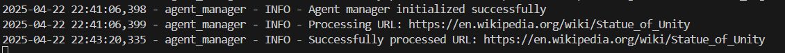

# 🤖 AI Web Scraping Agent

An intelligent AI-powered agent that performs **web scraping**, **content summarization**, **sentiment analysis**, and **metadata extraction** from any website using state-of-the-art language models like **BART**, **DistilBERT**, and **Mixtral** via Hugging Face.

---

## 🚀 Features

- 🌐 **Web Scraping**: Extracts meaningful content from any given URL using `trafilatura` and `BeautifulSoup`.
- 🧠 **AI Summarization**: Summarizes large texts using Hugging Face’s `facebook/bart-large-cnn` model.
- 📝 **Metadata Extraction**: Extracts titles and keywords from websites. Falls back to Mixtral if not available.
- 💬 **Sentiment Analysis**: Analyzes sentiment (positive, negative, or neutral) of the web content.
- 🔁 **Fallback Mechanisms**: Uses Mixtral as a backup when standard methods fail.
- 📦 **Modular Python Class**: Easy-to-use, extendable class for developers.

---

## 🛠 Installation

1. Clone the repository:

```bash
https://github.com/balasurya20/Zocket_Task_AI_Agent.git
cd Zocket_Task_AI_Agent
```

2. Create a virtual environment and install dependencies:

```bash
python -m venv venv
source venv/bin/activate  # On Windows: venv\Scripts\activate
pip install -r requirements.txt
```

3. Add your Hugging Face API Key in the class constructor (optional for public models):

```python
agent = ScraperAgent(hf_api_key="your_huggingface_api_key")
```
4. Create .env:

Upload your Hugging face id there : HF_API_KEY = "YOUR_KEY"

---

## 📚 Usage & Output
---
# UI


---
# Result


---
# Sentiment


---
# Raw content


---
# Terminal


## 🧠 Powered By

- [Trafilatura](https://github.com/adbar/trafilatura)
- [BeautifulSoup](https://www.crummy.com/software/BeautifulSoup/)
- [Hugging Face Transformers](https://huggingface.co/)
- `facebook/bart-large-cnn` – Summarization  
- `distilbert-base-uncased-finetuned-sst-2-english` – Sentiment  
- `mistralai/Mixtral-8x7B-Instruct-v0.1` – Title/Keyword fallback and sentiment fallback  


---

## ✨ Contributing

Pull requests are welcome! For major changes, open an issue first to discuss what you would like to change or improve.

---

## 🧑‍💻 Author

Created by [Balasurya P T](https://github.com/balasurya20).  
Feel free to reach out or star the repo if you found it useful!

---

